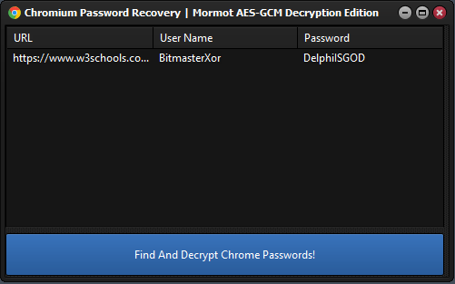

<h1>Chrome Password Recovery Tool</h1>

This Delphi application helps recover saved passwords from Google Chrome's profile data. It decrypts the encrypted passwords stored in Chrome for retrieval.

<!-- Replace 'Preview.png' with the path to your actual image file -->

  

<h2>Features</h2>
<ul>
  <li><strong>Recover Saved Passwords:</strong> Extract passwords stored in Chrome.</li>
  <li><strong>Decrypt Passwords:</strong> Decrypts encrypted passwords for access.</li>
  <li><strong>User-Friendly Interface:</strong> Simple and easy to use.</li>
</ul>

<h2>Installation</h2>
<ol>
  <li><strong>Open Delphi Project:</strong> Open the `.dpr` file in Delphi IDE.</li>
  <li><strong>Compile:</strong> Build the project to generate the executable.</li>
  <li><strong>Run:</strong> Execute the tool to start using it.</li>
</ol>

<h2>Usage</h2>
<ol>
  <li><strong>Launch the Application:</strong> Run the tool to automatically locate and scan the Chrome profile directory.</li>
  <li><strong>View Recovered Passwords:</strong> The passwords will be displayed within the application's interface.</li>
</ol>

<h2>Contributing</h2>

Contributions are welcome! If you have improvements or bug fixes, please fork the repository and submit a pull request.

<h2>License</h2>

This project is provided as is without warantee, use at your own risk!

